# Claude Code Viewer

[](https://github.com/d-kimuson/claude-code-viewer/blob/main/LICENSE)
[](https://github.com/d-kimuson/claude-code-viewer/actions/workflows/ci.yml)
[](https://github.com/d-kimuson/claude-code-viewer/releases)


A full-featured web-based Claude Code client that provides complete interactive functionality for managing Claude Code projects. Start new conversations, resume existing sessions, monitor running tasks in real-time, and browse your conversation history—all through a modern web interface.

https://github.com/user-attachments/assets/090d4806-163f-4bac-972a-002c7433145e

## Important Notice: Agent SDK and Subscription Usage

> [!WARNING]
> As of April 2026, Anthropic's [Terms of Service](https://code.claude.com/docs/en/legal-and-compliance#authentication-and-credential-use) prohibit using the Agent SDK to **send chat messages** with a subscription account. While Anthropic's X/Twitter announcements suggested personal use may be acceptable, the boundary between permitted and prohibited use remains ambiguous.
>
> In response, **chat sending, session resuming, permission approval, and `AskUserQuestion`** have been made opt-in.
>
> Note that real-time conversation log viewing, session history browsing, Git operations, and all other read-oriented features are implemented independently of the Agent SDK and remain fully available regardless of your authentication mode. You can start a Claude Code session from the CLI (or the built-in terminal) and watch it live in Claude Code Viewer without any restrictions.

### Choosing Your Authentication Mode

On first launch (or from the Settings screen), you will be prompted to select your authentication method:

- **API Key** (default) — Uses the Anthropic API directly. All features, including chat sending, are fully available.
- **Subscription** — Opts out of Agent SDK chat features. The chat input switches to a copy mode: configure your session options in the form, then click the **Copy** button to get the equivalent `claude` CLI command with the corresponding arguments already set. Paste and run it in any terminal to start or resume your session. Once the session is running, Claude Code Viewer will display the conversation in real-time as usual.

### Built-in Terminal

Claude Code Viewer includes an integrated terminal emulator accessible via the **panel at the bottom of the screen**. Open it, paste the copied command, and launch Claude Code without ever leaving the browser.

---

## Introduction

Claude Code Viewer is a web-based Claude Code client focused on **comprehensive session log analysis**. It preserves and organizes all conversation data through strict schema validation and a progressive disclosure UI that reveals details on demand.

**Core Philosophy**: Zero data loss + Effective organization + Remote-friendly design

## System Requirements

- **Node.js**: Version 22.13.0 or later
- **Claude Code**: v1.0.125 or later
- **Operating Systems**: macOS and Linux (Windows is not supported)

## Installation & Usage

### Quick Start (CLI)

Run directly from npm without installation:

```bash
npx @kimuson/claude-code-viewer@latest --port 3400
```

Alternatively, install globally:

```bash
npm install -g @kimuson/claude-code-viewer
claude-code-viewer --port 3400
```

The server will start on port 3400 (or the default port 3000). Open `http://localhost:3400` in your browser to access the interface.

**Available Options:**

```bash
claude-code-viewer [options]

Options:
  -p, --port <port>                Port to listen on (default: 3000)
  -h, --hostname <hostname>        Hostname to listen on (default: localhost)
  -v, --verbose                    Enable verbose debug logging
  -P, --password <password>        Password for authentication
  -e, --executable <executable>    Path to Claude Code executable
  --claude-dir <claude-dir>        Path to Claude directory
  --api-only                       Run in API-only mode without Web UI
```

### Remote Access via Tailscale (Mobile / PWA)

Claude Code Viewer works great as a persistent server you access from your phone. A convenient approach is to run it on a always-on machine and expose it over [Tailscale](https://tailscale.com/) with HTTPS:

1. **Set up HTTPS on your Tailscale node** following the [Tailscale HTTPS certificates guide](https://tailscale.com/docs/how-to/set-up-https-certificates).
2. **Start Claude Code Viewer** bound to all interfaces with a password:

   ```bash
   claude-code-viewer --hostname 0.0.0.0 --port 3400 --password your-secret
   ```

3. **Access from your phone** via the Tailscale HTTPS URL (e.g. `https://your-machine.ts.net:3400`).

Claude Code Viewer is a **PWA (Progressive Web App)**. On mobile, tap "Add to Home Screen" to get an app-like experience with an optimized UI and push notifications when sessions complete.

## Configuration

### Command-Line Options and Environment Variables

Claude Code Viewer can be configured using command-line options or environment variables. Command-line options take precedence over environment variables.

| Command-Line Option             | Environment Variable        | Description                                                                                                                                                                                                                                                                                                    | Default       |
| ------------------------------- | --------------------------- | -------------------------------------------------------------------------------------------------------------------------------------------------------------------------------------------------------------------------------------------------------------------------------------------------------------- | ------------- |
| `-p, --port <port>`             | `PORT`                      | Port number for Claude Code Viewer to run on                                                                                                                                                                                                                                                                   | `3000`        |
| `-h, --hostname <hostname>`     | `HOSTNAME`                  | Hostname to listen on for remote access                                                                                                                                                                                                                                                                        | `localhost`   |
| `-v, --verbose`                 | —                           | Enable verbose debug logging. Outputs detailed server-side logs to stderr for troubleshooting                                                                                                                                                                                                                  | (unset)       |
| `-P, --password <password>`     | `CCV_PASSWORD`              | Password for authentication. When set, enables password-based authentication to protect access to Claude Code Viewer. All `/api` routes (except login, logout, check, config, and version endpoints) require authentication. If not set, authentication is disabled and the application is publicly accessible | (none)        |
| `-e, --executable <executable>` | `CCV_CC_EXECUTABLE_PATH`    | Path to Claude Code installation. If not set, uses system PATH installation, or falls back to bundled version from dependencies                                                                                                                                                                                | (auto-detect) |
| `--claude-dir <claude-dir>`     | `CCV_GLOBAL_CLAUDE_DIR`     | Path to Claude directory where session logs are stored                                                                                                                                                                                                                                                         | `~/.claude`   |
| `--terminal-disabled`           | `CCV_TERMINAL_DISABLED`     | Disable the in-app terminal panel when set to `1`/`true` (env) or when the flag is present (CLI)                                                                                                                                                                                                               | (unset)       |
| `--terminal-shell <path>`       | `CCV_TERMINAL_SHELL`        | Shell executable for terminal sessions (e.g. `/bin/zsh`)                                                                                                                                                                                                                                                       | (auto-detect) |
| `--terminal-unrestricted`       | `CCV_TERMINAL_UNRESTRICTED` | When set to `1` (env) or when the flag is present (CLI), disables the restricted shell flags for bash                                                                                                                                                                                                          | (unset)       |
| `--api-only`                    | `CCV_API_ONLY`              | Run in API-only mode. Disables Web UI, terminal WebSocket, and non-essential endpoints. Only core API routes (`/api/version`, `/api/config`, `/api/projects`, `/api/claude-code`, `/api/search`, `/api/sse`) are exposed. Useful for integrating with external tools like n8n                                  | (unset)       |

**Breaking Change**: Environment variable names have been changed. If you're using environment variables, update them as follows:

- `CLAUDE_CODE_VIEWER_AUTH_PASSWORD` → `CCV_PASSWORD`
- `CLAUDE_CODE_VIEWER_CC_EXECUTABLE_PATH` → `CCV_CC_EXECUTABLE_PATH`
- New environment variable added: `CCV_GLOBAL_CLAUDE_DIR` (previously the Claude directory path was hardcoded to `~/.claude`)

### API Authentication

When `--password` / `CCV_PASSWORD` is set, all `/api` routes (except auth-related endpoints) require authentication. You can authenticate in two ways:

1. **Session cookie**: Use the `/api/auth/login` endpoint to set the `ccv-session` cookie, then include it in subsequent requests.
2. **Authorization header**: Send `Authorization: Bearer <password>` on each request.

If no password is configured, API authentication is disabled.

### User Settings

Settings can be configured from the sidebar in Claude Code Viewer.

| Setting                              | Default                      | Description                                                                                                                                                                                                                                                                                   |
| ------------------------------------ | ---------------------------- | --------------------------------------------------------------------------------------------------------------------------------------------------------------------------------------------------------------------------------------------------------------------------------------------- |
| Hide sessions without user messages  | true                         | Claude Code creates logs for operations like `/compact` that aren't tied to actual tasks, which can create noise. When enabled, sessions without user messages are hidden.                                                                                                                    |
| Unify sessions with same title       | false                        | When resuming, Claude Code creates a new session with regenerated conversation logs. When enabled, only the latest session with the same title is displayed.                                                                                                                                  |
| Auto-schedule Continue on Rate Limit | false                        | Automatically schedules a continue message when Claude hits rate limits. When enabled, the system detects rate limit errors in live sessions and creates a scheduled job to send "continue" one minute after the limit reset time. This prevents manual intervention for rate limit recovery. |
| Enter Key Behavior                   | Shift+Enter                  | Specifies which key combination sends messages. Options include Enter, Shift+Enter, and Command+Enter.                                                                                                                                                                                        |
| Search Hotkey                        | Command+K                    | Select the hotkey to open the search dialog. Options include Ctrl+K and Command+K.                                                                                                                                                                                                            |
| Find Hotkey                          | Command+F                    | Select the hotkey to open the in-page find bar. Options include Ctrl+F and Command+F.                                                                                                                                                                                                         |
| Model Choices                        | default, haiku, sonnet, opus | Customize the list of model options shown in the Session Options Toolbar. Add any model identifier supported by Claude Code (e.g. `claude-opus-4-5`).                                                                                                                                         |
| Permission Mode                      | Ask permission               | Controls the approval logic when Claude Code requests tool invocations. Configured per project via the Session Options Toolbar above the chat input. Requires Claude Code v1.0.82 or later.                                                                                                   |
| Theme                                | System                       | Toggles between Dark Mode and Light Mode. Default follows system settings.                                                                                                                                                                                                                    |
| Notifications                        | None                         | Enables sound notifications when running session processes complete. Choose from multiple notification sounds with test playback functionality.                                                                                                                                               |
| Language                             | System                       | Interface language selection. Supports English, Japanese, and Simplified Chinese with automatic system detection.                                                                                                                                                                             |

### Environment Variables

**CCV_ENV Consideration**: If you have `CCV_ENV=development` set in your environment, the application will start in development mode. For production use, set `CCV_ENV=production` or leave it unset.

## Features

| Feature                 | Description                                                                                                                                                                                                                                                                                                                                                              |
| ----------------------- | ------------------------------------------------------------------------------------------------------------------------------------------------------------------------------------------------------------------------------------------------------------------------------------------------------------------------------------------------------------------------ |
| View Chat Logs          | View Claude Code session logs in real-time through the web UI. Supports historical logs as it uses standard Claude Code logs (~/.claude/projects/...) as the data source                                                                                                                                                                                                 |
| Search Conversations    | Full-text search across conversations with `⌘K` (macOS) or `Ctrl+K` (Linux). Search within a specific project or across all projects. Features fuzzy matching, prefix search, and keyboard navigation (↑↓ to navigate, Enter to select)                                                                                                                                  |
| In-page Find            | Jump to any text in the current conversation with a configurable hotkey (`Ctrl+F` / `Command+F`). Cycles through all matches with keyboard navigation                                                                                                                                                                                                                    |
| Start Conversations     | Start Claude Code sessions directly from Claude Code Viewer. Enjoy core functionality like file/command completion, pause/resume, and tool approval through a superior web experience                                                                                                                                                                                    |
| Resume Sessions         | Resume conversations directly from existing session logs                                                                                                                                                                                                                                                                                                                 |
| Continue Sessions       | Claude Code Viewer provides advanced session process control. Sessions started through Claude Code Viewer remain alive (unless aborted), allowing you to continue conversations without resuming (no session-id reassignment)                                                                                                                                            |
| Create Projects         | Create new projects from Claude Code Viewer. Select a directory through the web UI to execute the `/init` command and begin project setup                                                                                                                                                                                                                                |
| Session Options Toolbar | Inline toolbar above the chat input for configuring per-project session options: model selection, thinking effort (low/medium/high/max), permission mode, and system prompt preset. Settings persist per project                                                                                                                                                         |
| Voice Input             | Dictate messages directly in the chat input using the built-in voice input button. Transcribed text is inserted into the input field for review before sending                                                                                                                                                                                                           |
| File Upload & Preview   | Upload images (PNG, JPEG, GIF, WebP), PDFs, and text files directly from the chat interface. Each file type displays with dedicated preview components—images render inline, PDFs embed with a viewer, and text files show formatted content                                                                                                                             |
| Clipboard Image Paste   | Paste images directly from the clipboard into the chat input with `Ctrl+V` / `⌘+V`. Pasted images are attached and previewed before sending                                                                                                                                                                                                                              |
| Chat Draft Saving       | Chat input drafts are automatically saved per project and session. Unsent text is restored when returning to the same conversation                                                                                                                                                                                                                                       |
| Browser Preview         | Preview web applications directly within Claude Code Viewer. Click the preview button on any URL in chat messages to open a resizable browser panel on the right side. Features include URL input with keyboard navigation, reload functionality, and automatic chat window width adjustment. The embedded browser tracks URL changes as you navigate (same-origin only) |
| Message Scheduler       | Schedule Claude Code messages using cron expressions for recurring tasks or specific datetime for one-time execution. Supports concurrency control (skip/run) for periodic jobs and auto-deletion for reserved jobs                                                                                                                                                      |
| Review Changes          | Built-in Git Diff Viewer lets you review all changes directly within Claude Code Viewer. Supports inline diff comments for annotating specific lines                                                                                                                                                                                                                     |
| Commit Changes          | Execute Git commits directly from the web interface within the Git Diff Viewer                                                                                                                                                                                                                                                                                           |
| Push Changes            | Push committed changes directly from the Git Diff Viewer. Supports both separate push operations and combined commit-and-push workflows for streamlined deployment                                                                                                                                                                                                       |
| Branch Switcher         | Switch local Git branches directly from the Git tab (with search and status indicators)                                                                                                                                                                                                                                                                                  |
| Explorer                | Right panel tab that summarizes edited files with action buttons, groups them by project, lists tool invocations with filters and quick file preview, and shows agent sub-sessions in a dedicated section                                                                                                                                                                |
| Visual Tool Display     | Tool invocations render with dedicated visual components (e.g. file diffs, structured outputs). A Raw toggle switches to the plain JSON view when needed                                                                                                                                                                                                                 |
| Todo Viewer             | Extracts the latest `TodoWrite` items from sessions and displays them as inline collapsible checklists directly within the conversation                                                                                                                                                                                                                                  |
| PR Link Display         | Pull request metadata (title, number, URL) from `pr-link` log entries is rendered as a rich card in the conversation, making it easy to navigate to associated PRs                                                                                                                                                                                                       |
| Copy Buttons            | Every markdown message includes a copy button to copy the full text content to clipboard with a single click                                                                                                                                                                                                                                                             |
| Project Switcher        | Quickly jump to any project via the combobox in the header without navigating back to the projects list                                                                                                                                                                                                                                                                  |
| Inline Approvals        | Tool permission requests and custom questions from the `CCVAskUserQuestion` MCP tool are surfaced as inline panels directly in the chat, removing the need to switch to another window for approval                                                                                                                                                                      |
| Terminal Panel          | Bottom panel terminal over WebSocket for running shell commands without leaving the UI                                                                                                                                                                                                                                                                                   |
| MCP Server Viewer       | View MCP server configurations directly in the session sidebar. Lists all configured servers with their names and commands, with real-time reload capability                                                                                                                                                                                                             |
| PWA Support             | Install Claude Code Viewer as a Progressive Web App on desktop or mobile. Supports home screen installation and push notifications for session completion events                                                                                                                                                                                                         |
| System Information      | Monitor Claude Code and Claude Code Viewer versions, feature compatibility, and system status                                                                                                                                                                                                                                                                            |
| Multi-language Support  | Full internationalization support with English, Japanese, and Simplified Chinese language options                                                                                                                                                                                                                                                                        |

## Screenshots

| Feature                       | Capture                                                                                                                                                                                                                                                                      |
| ----------------------------- | ---------------------------------------------------------------------------------------------------------------------------------------------------------------------------------------------------------------------------------------------------------------------------- |
| BasicChat (Desktop)           | 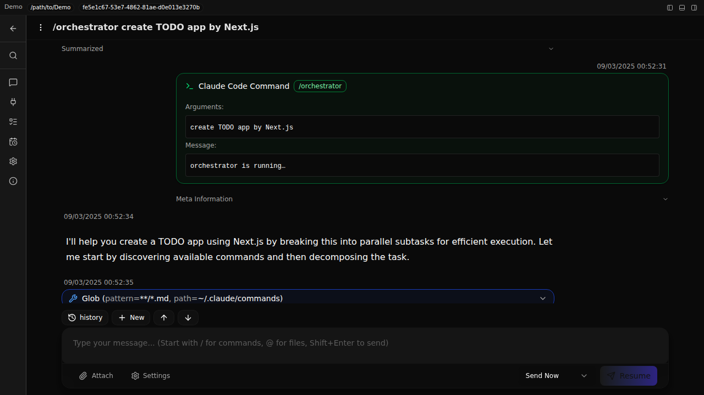                               |
| BasicChat (Mobile)            | 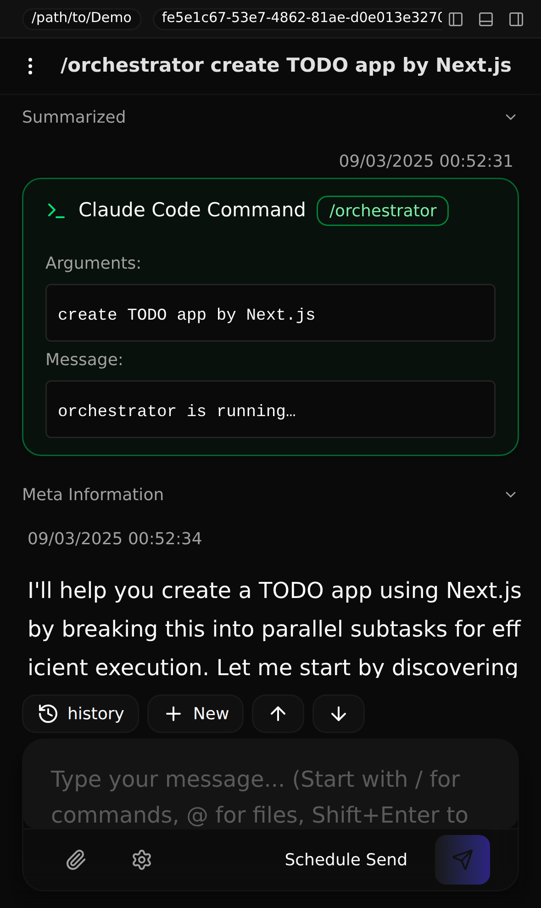                                |
| Browser Preview (Right Panel) | 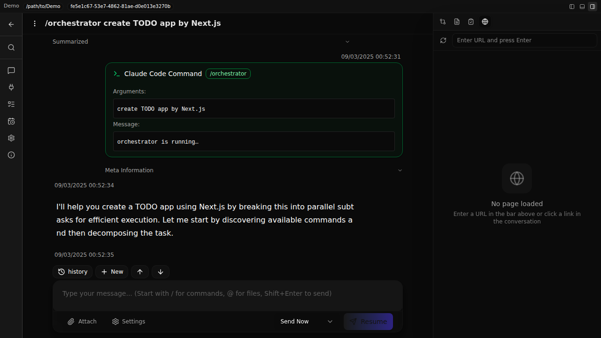    |
| Git Tab (Right Panel)         |     |
| Review Panel (Right Panel)    | 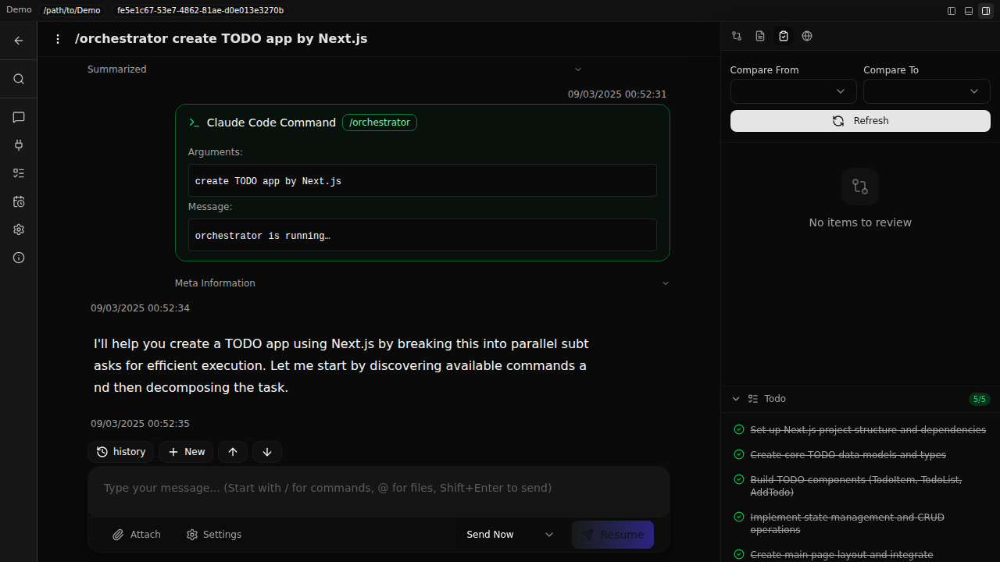     |
| File Diffs (Right Panel)      | 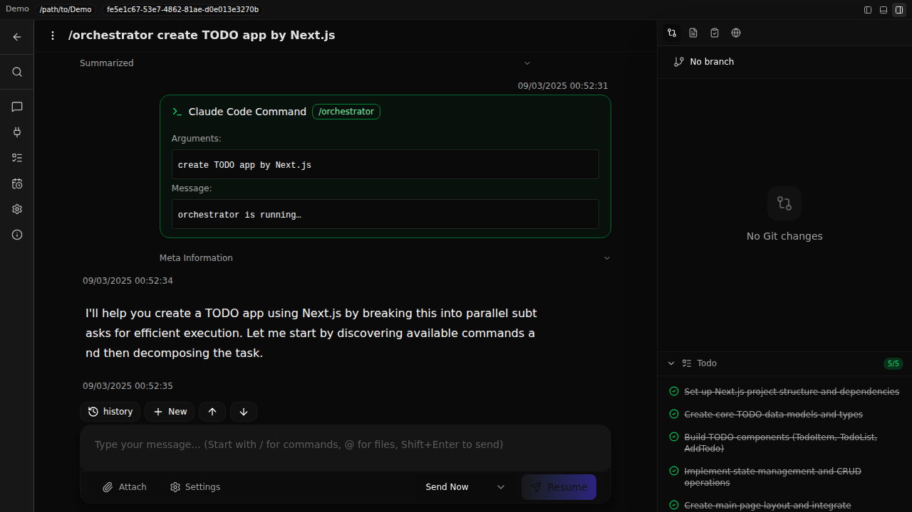 |
| Settings                      | 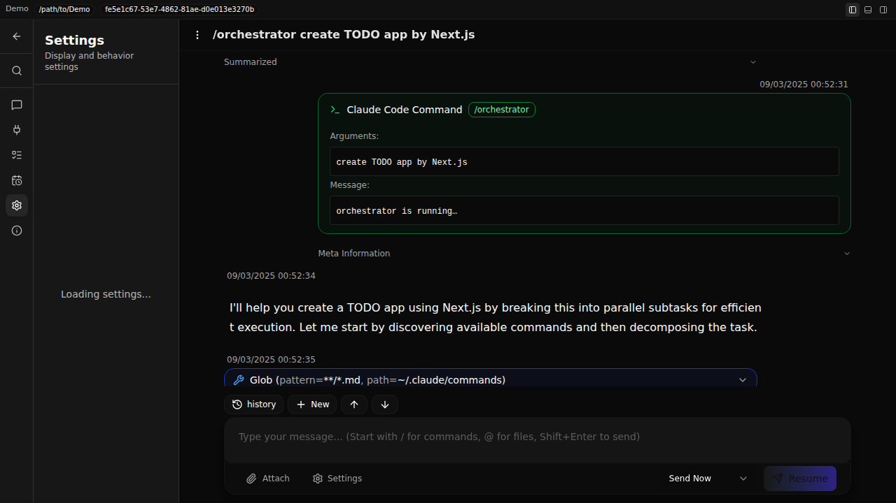                  |
| Start New Chat                | 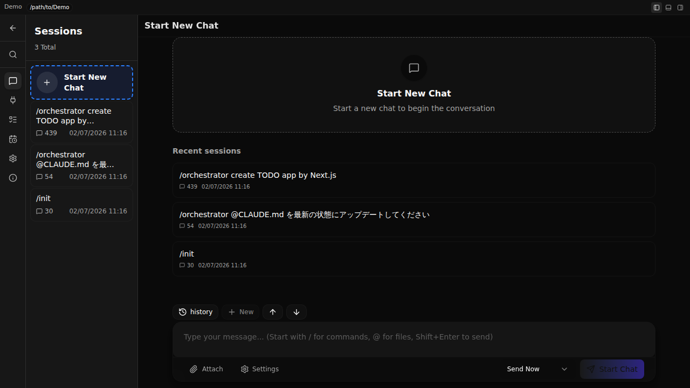                |
| Projects List                 | 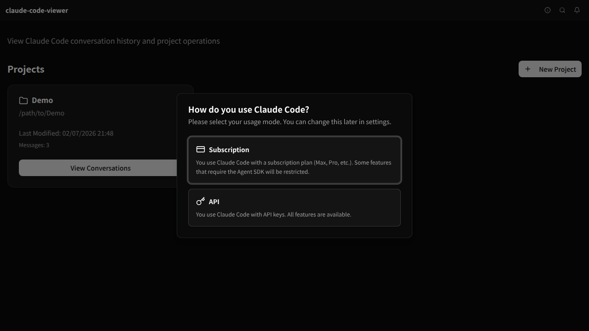                                                                                                                                                                                                                               |
| New Project Modal             | 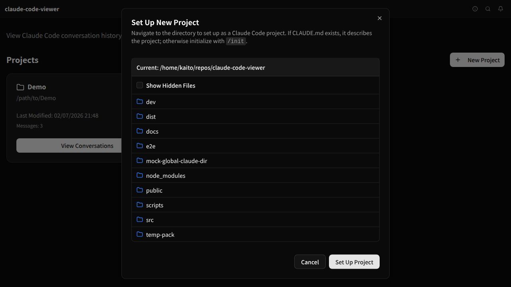                                                                                                                                                                                                             |
| CommandCompletion             | 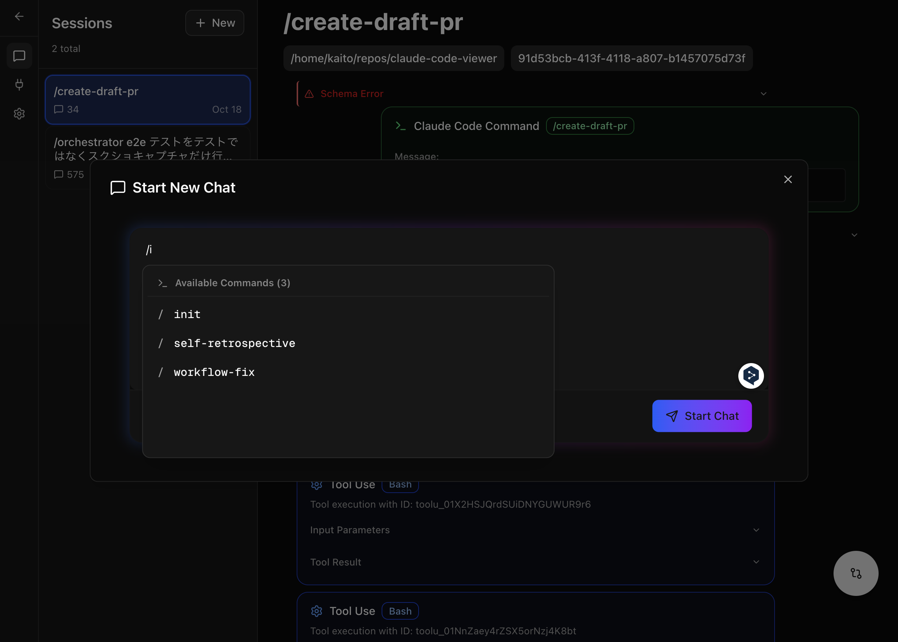                                                                                                                                                                                                                                    |
| FileCompletion                | 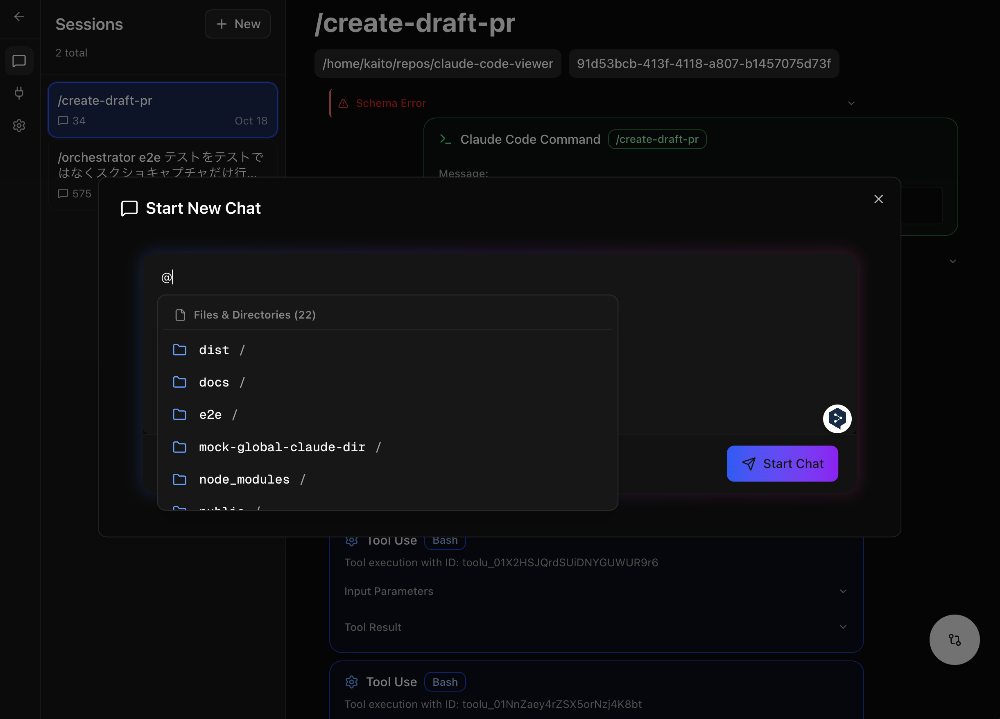                                                                                                                                                                                                                                       |
| Diff Viewer                   | 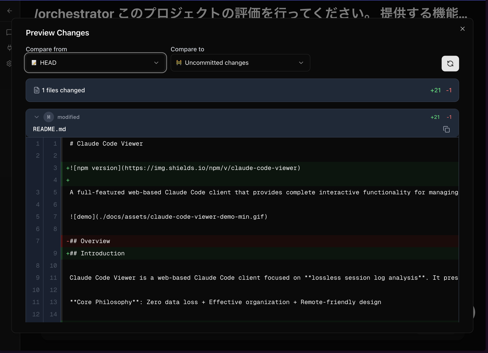                                                                                                                                                                                                                                              |

Note: Additional UI screenshots are available in [/e2e/snapshots/](./e2e/snapshots/)

## Data Source

The application reads Claude Code conversation logs from:

- **Location**: `~/.claude/projects/<project>/<session-id>.jsonl`
- **Format**: JSONL files containing conversation entries
- **Auto-detection**: Automatically discovers new projects and sessions

> [!NOTE]
> **30 Day Session Cleanup Default:** Claude Code defaults to auto-delete all session transcripts older than 30 days. Claude Code Viewer does not make backups of your session files so when the `.jsonl` files get deleted those sessions will no longer exist in Claude Code Viewer. To override the 30 day retention default, add [`cleanupPeriodDays`](https://code.claude.com/docs/en/settings) with a number greater than 30 in `~/.claude/settings.json` and restart Claude Code.
>
> ```json
> {
>   "cleanupPeriodDays": 365
> }
> ```

## Internationalization (i18n)

Claude Code Viewer currently supports **English**, **Japanese**, and **Simplified Chinese (简体中文)**. Adding new languages is straightforward—simply add a new `messages.json` file for your locale (see [src/i18n/locales/](./src/i18n/locales/) for examples).

If you'd like support for your language, please open an issue—we'll add it quickly!

## Alternatives & Differentiation

### Official Solution: Claude Code on the Web

Anthropic provides [Claude Code on the Web](https://docs.claude.com/en/docs/claude-code/claude-code-on-the-web), which runs Claude Code sessions in Anthropic's cloud VMs. Each session clones your repository and executes predefined setup commands (e.g., `pnpm install`).

**When to use Claude Code on the Web**:

- Quick testing without local setup or self-hosting infrastructure
- Casual development from mobile devices or public computers
- Simple repository structures with single CLAUDE.md at the root

**When to use Claude Code Viewer**:

- Working with pre-configured local environments (databases, services, large dependencies)
- Monorepo projects with multiple CLAUDE.md files in different directories
- Development requiring significant computational resources or long-running processes
- Preference for self-hosted infrastructure with full control over the development environment

### Community Web Clients

Several excellent community-built web clients exist:

- https://github.com/sugyan/claude-code-webuisupport
- https://github.com/wbopan/cui
- https://github.com/siteboon/claudecodeui

**What Makes Claude Code Viewer Different**: While these tools excel as general-purpose web clients, Claude Code Viewer is specifically designed as a **session log viewer** with:

- **Zero Information Loss**: Strict Zod schema validation ensures every conversation detail is preserved
- **Progressive Disclosure**: Expandable elements and sub-session modals help manage information density
- **Built-in Git Operations**: Comprehensive diff viewer with direct commit functionality for remote development workflows
- **Session Flow Analysis**: Complete conversation tracking across multiple sessions
- **System Monitoring**: Real-time version and feature compatibility monitoring
- **International Accessibility**: Multi-language support for global development teams

Each tool serves different use cases—choose the one that best fits your workflow and priorities.

## Remote Development

Claude Code Viewer is designed with remote hosting in mind. To support remote development workflows, it includes:

- **Mobile-Optimized UI**: Responsive interface with dedicated mobile sidebar and touch-optimized controls
- **Built-in Git Operations**: Review and commit changes directly from the web interface
- **Real-time Notifications**: Audio notifications for task completion to maintain workflow awareness
- **System Monitoring**: Monitor Claude Code compatibility and feature availability across environments

The application features a separated client-server architecture that enables remote hosting. **Basic password authentication is available** via the `--password` command-line option or `CCV_PASSWORD` environment variable. When set, users must authenticate with the configured password before accessing the application. However, this is a simple single-password authentication mechanism without advanced features like multi-user support, role-based access control, or OAuth integration. If you require more sophisticated authentication, carefully evaluate your security requirements and implement appropriate access controls at the infrastructure level (e.g., reverse proxy with OAuth, VPN, IP whitelisting).

## Privacy

For information about privacy and network communication, see [PRIVACY.md](./PRIVACY.md).

## License

This project is available under the MIT License.

## Contributing

See [docs/dev.md](docs/dev.md) for detailed development setup and contribution guidelines.
